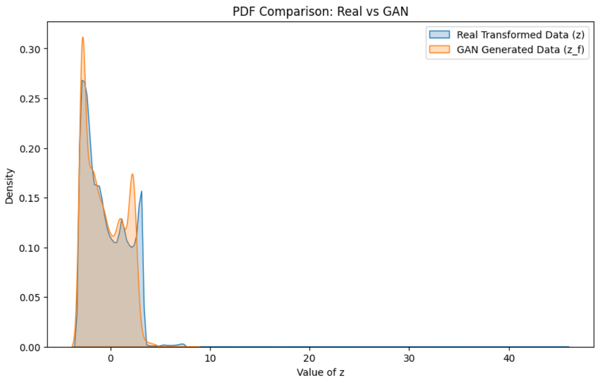

# Learning PDF Using GAN

## Dataset
- India Air Quality Dataset (Kaggle)
- Feature used: NO₂ concentration (`x`)

---

## Transformation
The feature `x` is transformed to `z` using:
r = 102317254
ar = 0.5 * (r % 7)
br = 0.3 * (r % 5 + 1)

---

## GAN Architecture

### Generator
- Input: Gaussian noise N(0,1)
- Layers: 1 → 64 → 128 → 1
- Activations: ReLU

### Discriminator
- Input: Sample (real or fake)
- Layers: 1 → 128 → 64 → 1
- Activations: LeakyReLU, Sigmoid

Training uses Binary Cross Entropy loss and Adam optimizer.

---

## PDF Estimation
After training the GAN:
- Samples are generated from the Generator
- PDF is estimated using:
  - Histogram Density Estimation
  - Kernel Density Estimation (KDE)

---

## Observations

### Mode Coverage
- Major modes of the real distribution are captured.
- Minor deviations occur in low-density regions.

### Training Stability
- GAN training remains stable.
- No significant mode collapse observed.

### Quality of Generated Distribution
- Generated samples closely match the real data distribution.
- KDE and histogram plots show good overlap.

---

## Conclusion
The GAN successfully learns the unknown probability density function of the transformed variable using data only, without assuming any parametric form.
